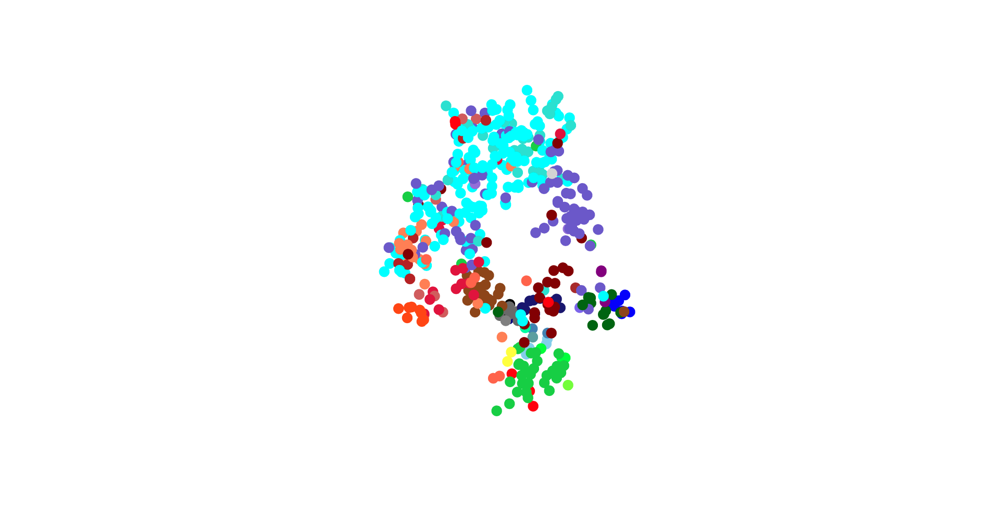

<h1 align="center">NeuralGREWT:<br>Neural Grammar Rule Extraction and Word Taxonomy</h1>

[](http://blackboxlabs.dev/neuralgrewt)
<a target="_blank" href="http://blackboxlabs.dev/neuralgrewt"><p align="center">Click to Interact</p></a>


Unsupervised learning and comprehensible representation of grammar rules and
fuzzy symbol categories by high-dimensional clustering of string probabilities
derived from natural language models and Comprehensible Convolutional Neural
Networks (CCNN).

## Theory
A <em>grammar</em> is a set of rules for how symbols<sup id="a1">[1](#f1)</sup>
may be arranged to form valid strings in a language. Strings of symbols  that
follow all grammar rules are grammatically <em>valid</em>.  Grammatic validity
is necessary for, but does not imply, sensicality.  For example: the string of
symbols (in this case a sentence of words) "The hat runs and cooks into a
hairdresser." is a grammatically valid sentence that is also nonsensical in
isolation<sup id="a2">[2](#f2)</sup>.

Given this definition of grammatic validity, valid sentences will be more
common than invalid ones in any string-set comprised mostly of sensical
strings; making it possible to infer a string's validity from its probability.

Therefore, it may be possible to learn grammar rules of any language, including
computer, fictional, and extra-terrestrial languages, without needing to make
sense of anything written in the given language<sup id="a3">[3](#f3)</sup>.

Let's test this hypothesis.

One good first step to learning grammar rules may be to identify the
different categories of symbols present in a given language.

Symbols will be said to share a syntactic <em>category</em> in proportion to
their mutual interchangability.  In other words: 2 symbols will share a
category in proportion to the probability that one may be replaced by the other
in a randomly chosen valid string without rendering that string invalid.

Knowing this, a natural language generator<sup id="a4">[4](#f4)</sup> can be
used to determine the degree of mutual interchangabilty of symbols in a
language using total string likelihood before and after replacement as an
indicator of relative validity, and therefore of mutual interchangeability
&mdash; implying taxonomy.  Once we have these validity scores we can use T-SNE
to infer discrete symbol categories from the degree of mutual interchangability
(or equivalently the clustering of validity-under-replacement scores).

## Procedure
- Compile a large <em>corpus</em> of valid and/or sensical writings in the
  chosen language.
- Train a natural language model, or <em>predictor</em>, on the corpus until it
    is very good at predicting
    symbols in the language given context. Anything like BERT or GPT-2 will do
    fine, and in fact are probably overkill.
    - NOTE: It's definitely overkill. Future work will employ a
        maximally-minimal version of BERT to accellerate calculation of validity
        tensors and eliminate "understanding intrusion". Large BERT and GPT-2 models
        possess a good deal of "understanding" of written text that leads them to rank
        the probability of valid but otherwise non-sensical strings signficantly
        lower than they would if they possessed only an understanding of base grammar
        relationships. Clearly this is not good if we are looking for a measure of
        base validity, regardless of sensicality<sup id="a5">[5](#f5)</sup>.
- Compile a large "ground set" of valid and/or meaningful strings in the chosen language.
    (in the case of unknown languages, this ground set can just be a random
    subset of the corpus)
- Compile a "symbol set" of all symbols in the chosen language, or at least a large
    set of the most common ones.
- Create a 4 dimensional <em>perturbation tensor</em> from the ground and symbol sets by:
    - Add to the perturbation tensor a <em>cube</em> for each <em>symbol</em>
        in the symbol set; construct each cube by stacking a <em>plane</em> for
        each <em>ground string</em> in the ground set; construct each plane by stacking
        a <em>vector</em> for all strings that can be created by replacing any one item
        in the ground string with the symbol. Of course, making sure to do this in the
        same order for all vectors<sup id="a6">[6](#f6)</sup>.
- Create a 4 dimensional <em>validity tensor</em> from the perturbation tensor by:
    - For each vector in the perturbation tensor, judge the probability
        of that vector by summing the relative likelihoods of each symbol
        appearing at its location given all previous symbols in the vector (using the
        predictor), taking the difference between this and the sum-validity of it's
        corresponding ground string to obtain a <em>validity delta</em>, and dividing
        by the length of that vector. That division might be unnecessary, but we will
        find out.
        - Update: It occurs to me that the division by sentence length would
            have a largely unhelpful effect on the validity score of any one
            dimension relative to all the others; exaggerating similarities between
            dimensions as vectors grow longer. The ground-truth validity delta may or may
            not have anything to do with string length depending on the language so it is
            wrong to force such a correlation in general.  A proper normalization across
            all dimensions regarded equally is what we want here.
- Perform T-SNE followed by PCA on the validity tensor to infer number and
    relative importance of symbol categories.
    - NOTE: In this case PCA will not, and cannot provide a useful classifier
        for datapoints that were not already present in the T-SNE plot.  Here we
        are simply looking to quantify the number of clusters, and get some small idea
        of the distances between clusters<sup id="a7">[7](#f7)</sup>.
- Name each symbol category. (can be totally arbitrary)
- Create a <em>sym-cat</em> mapping of each symbol to a list of its categories
    sorted in descending order of the symbol's <em>belongingness</em> to each category.
- Create a <em>cat-sym</em> mapping of each category to a list of its symbols
    sorted in descending order of each symbol's belonging-ness to the category.
- Create a <em>token set</em> from the corpus by replacing each symbol in the
    corpus with a name, or <em>token</em>, for its corresponding category<sup
    id="a8">[8](#f8)</sup>.
- Create a <em>garbage set</em> from the token set by randomizing a large
    enough proportion of the tokens in the token set to render each string likely
    invalid.
- Train a comprehensible, spiking, convolutional neural network, or
    <em>grammar net</em>, to distinguish between items of the token and garbage
    sets.
    - The filters of the trained grammar net are first order grammar rules, the
        fully connected layers behind those are second order grammar rules, and
        so on. (or something to that effect depending on the structure of the grammar
        net.)

## Status
- [x] Gather Corpus
- [x] Train Natural Language Model (GPT-2)
- [x] Compile Ground Set
- [x] Compile Symbol Set
- [x] Generate Perterbation Tensor
- [x] Calculate Validity Tensor
    - Signs from the first few checkpoints are looking very promising.
        Replacements known to largely preserve validity (such as pronouns with
        any other pronoun) are displaying markedly higher probability to the predictor.
        The trend is so striking that it is visible to the naked eye even before
        normalization. Feels like cheating a little bit, since I am trying to stick to
        a pre-registered method, and peeking at the data while it's being processed
        can't be good for my objectivity. I did have to look at least once to make sure
        that the program was calculating what I meant it to, so I suppose it can't be
        helped that I went looking for patterns like these. I'll just have to be extra
        careful not to let this good news inform any of my future decisions. Best way
        to do that is to make as few of them as possible and stick closely to the plan
        as written.
    - [ Trial set generated in 10 days of computation time on a GTX 1070 M ]
- [x] T-SNE
    - To improve our dynamic range, each dimension of the validity tensor
        is scaled independently of the others so that its values now
        range between -1 and 1 for all symbols. This is to ensure signals of
        dimensions with naturally smaller values are not so severly washed-out by
        signals of naturally larger dimensions in the next step.
    - After scaling, the validity tensor is passed through a heaviside function to produce
        a tensor of sparse boolean vectors with ones for all values above a
        specified threshold.  Implicitly, this means that all values above some
        high-but-ultimately-arbitrary validity threshold<sup id="a9">[9](#f9)</sup> are
        regarded as totally valid replacements, and all others are assumed to be
        equally invalid.
    - T-SNE was performed using the jaccardian dissimilarity index of each
        vector against every other vector as a distance metric together with
        Barnes-Hut approximation to find a good representation of the clustering in a
        visualizable space.
    - The step above was performed with many perplexities ranging from 5 to 50.
        Qualitative optimum was found to lie between 12.5 and 17.5<sup
        id="a10">[10](#f10)</sup>.
- [x] ~~PCA~~
    - It is clear from the visualization that PCA is not the best choice here
        afterall. The trouble now is not in finding those dimensions that best
        define the data, but in finding a way to idetify the boundaries of distinct
        (and not-so-distinct) t-sne clusters in the visualizable space with minimal if
        any human involvement. DBSCAN seems well suited to this task. Barring that,
        many of these clusters seem isolated enough to eyeball without injecting too
        much subjectivity (hence the reduction to visualizable space), but an automatic
        approach is always preferable.
- [ ] Automatic Cluster Identification with DBSCAN
- [ ] Category Naming and Mapping
- [ ] Generate Token and Garbage Sets
- [ ] Train Grammar Net
    - One good way to make the grammar net more comprehensible would be to use
    a very large number of filters in the convolutional layers and
    <strong>strong</strong> regularization across the board, so as to ensure that
    the vast majority of filters obviously do nothing<sup
    id="a11">[11](#f11)</sup>, while emphasizing the important few that communicate
    a lot.

## Results
- Word Taxonomy Visualization:
<!-- <div style="text-align: center;"> -->
<!-- &emsp;&emsp;&emsp;<a target="_blank" href="http://blackboxlabs.dev/neuralgrewt">Click for interactive visualization</a> -->
| Plot  | Legend |
| ------------- | ------------- |
|   |   |
<!-- </div> -->

[TBD]

## Footnotes

<b id="f1">1</b> More precisely: "morphemes" composed of symbols. [↩](#a1)

<b id="f2">2</b> "in isolation" meaning in the absence of explanatory context. [↩](#a2)

<b id="f3">3</b> So long as we are in possession of an ample body of text that
would be sensical to a speaker of that language. [↩](#a3)

<b id="f4">4</b> Any predictor of morphemes from context really. [↩](#a4)

<b id="f5">5</b> This will also ensure that we get a good measurement of
validity in some imaginable language where it is impossible to have
grammatically valid strings that don't make sense. This would mean only that
validity implies sensicality. In such languages, learning base validity is
identical to learning sensicality, which may-or-may-not require a larger
network to accomplish (interesting philosophical question there) but is
nevertheless possible as demonstrated by large language models of recent years.
[↩](#a5)

<b id="f6">6</b> In an actual tensor all such vectors need to be padded to
uniform dimension with null strings. In practice we can use a 3 dimensional
tensor of pointers to vectors of variable dimension. [↩](#a6)

<b id="f7">7</b> Distances between T-SNE clusters are sometimes meaningless, so
the distances according to PCA are not to be taken seriously in this case.
However, the number of clusters and degree of overlap communicated by PCA on
T-SNE will be reliably meaningful if good clusters are found.
- NOTE: this subtlety is obviated by PCA's replacement with DBSCAN in the
    cluster identification step. [↩](#a7)

<b id="f8">8</b> In the proof of concept we will simply pick the highest ranked
category from each symbol's entry in the sym-cat mapping. Future work will be
needed to make an informed choice of category in the case of context dependent
taxonomy. [↩](#a8)

<b id="f9">9</b> In this case above -5 or thereabouts after scaling. [↩](#a9)

<b id="f10">10</b> Specifically: optimimum for a set of 500 points in ~5500
dimensions. This optimimum is likely to change depending on your point-count to dimensionality ratio. [↩](#a10)

<b id="f11">11</b> or are lower-weighted, redundant duplicates that all do the
same thing [↩](#a11)

## How to Install
<!-- - Clone this repository. -->
[TBD]

## How to Use
[TBD]

## Contributing
For contributors to the project; do this before making your first commit:

- Install pre-commit
```bash
cd /path/to/this/repository/
sudo apt install pre-commit
pre-commit install
```
(we do all of our development on linux)

- To test updates to the readme and other GitHub flavored markdown, simply install Grip
and feed it your desired file.
```bash
pip3 install grip
python3 -m grip README.md
```
- Then follow the link provided by the Grip sever for a live preview of your work.

- When satisfied with your changes you can compile to an html file with:
```bash
python3 -m grip README.md --export README.html
```

## Authors
* **Gabe M. LaFond** - *Initial work* - [ExamDay](https://github.com/ExamDay)

See also the list of [contributors](https://github.com/ExamDay/NeuralGREWT/contributors) who participated in this project.

## License
This project is licensed under the MIT License - see the [LICENSE.md](LICENSE.md) file for details
